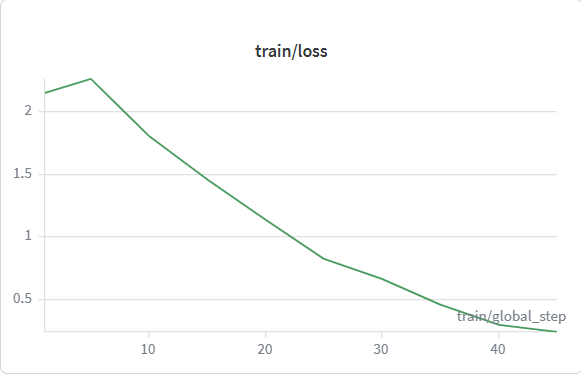
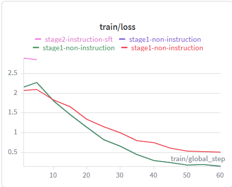
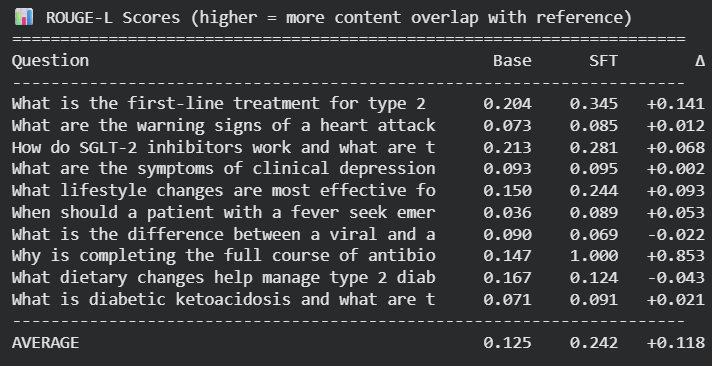
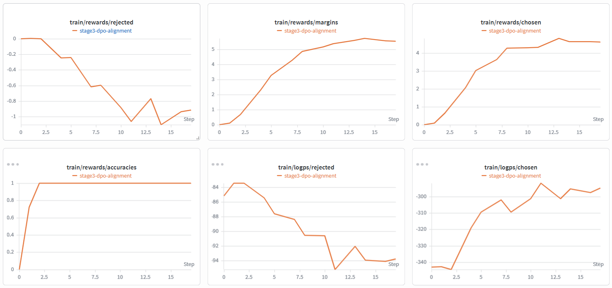
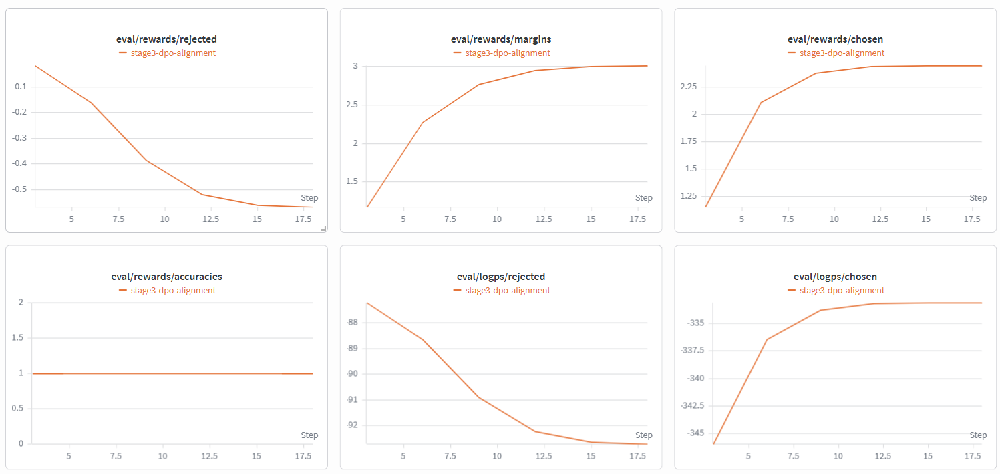

# 🏥 Healthcare AI Assistant
### Practical Fine-Tuning: Assignment 04 - Three-Stage LLM Pipeline

[](https://python.org)
[](https://github.com/unslothai/unsloth)
[](https://huggingface.co/Qwen)
[]()

---

## 1. Project Title

**Healthcare FAQ Assistant** - a domain-specific medical question-answering model built through a three-stage fine-tuning pipeline (Non-Instruction Pretraining → Supervised Fine-Tuning → DPO Preference Alignment) on top of Qwen2.5-1.5B-Instruct using Unsloth and QLoRA.

---

## 2. Domain Selected

**Healthcare / Clinical Medicine**

The model is trained to answer common medical questions across 8 clinical topic areas:
- Diabetes management (type 1, type 2, gestational, complications)
- Hypertension and blood pressure management
- Cardiovascular disease (heart attack, heart failure, atrial fibrillation)
- Respiratory conditions (asthma, COPD, pneumonia)
- Mental health (depression, anxiety, bipolar disorder)
- Pharmacology and medication safety
- Nutrition, lifestyle, and preventive medicine
- Infection prevention and antimicrobial resistance

---

## 3. Business Problem

**Problem:** Patients and non-specialist clinicians frequently need accurate, accessible answers to common medical questions. General-purpose LLMs can hallucinate medical facts, use imprecise clinical terminology, or give dangerous advice without appropriate safety caveats.

**Solution:** A three-stage fine-tuned model that:
1. Understands healthcare domain language precisely (Stage 1)
2. Follows structured instruction-answer format reliably (Stage 2)
3. Prefers safe, accurate, evidence-based responses over vague or misleading ones (Stage 3)

**Use case:** Internal FAQ assistant for a clinic or hospital — answering patient and clinician questions about medications, conditions, and treatment protocols, with appropriate safety disclaimers triggered automatically.

---

## 4. Dataset Details

| Dataset | File | Size | Description |
|---------|------|------|-------------|
| Non-instruction corpus | `data/non_instruction_data.txt` or `data/non_instruction_data.pdf` or `data/non_instruction_scanned_data.pdf` | 110 paragraphs | Raw clinical prose covering all 8 topic areas. Used for Stage 1 domain adaptation. Data can be in any format `.doc`, `.pdf`, `.txt` |
| Instruction dataset | `data/instruction_dataset.jsonl` | 296 pairs | Curated Q&A pairs in `{instruction, input, output}` format. Used for Stage 2 SFT. |
| Preference dataset | `data/preference_dataset.jsonl` | 100 pairs | Chosen/rejected response pairs in `{prompt, chosen, rejected}` format. Used for Stage 3 DPO. |
| Dataset statistics | `data/data_stats.json` | — | Quality metrics: paragraph counts, word counts, topic distribution. |

**Data sourcing:** All data was curated from publicly available clinical knowledge and generated using structured templates across 8 topic areas. A GPT-4 generation script (`data/generate_with_gpt4.py`) generates this data.

**Rubric compliance:**
- Non-instruction: 110 paragraphs ✅ (min 50 required — 2.2× over minimum)
- Instruction pairs: 296 ✅ (min 100 required — 2.96× over minimum)
- Preference pairs: 100 ✅ (min 50 required — 2× over minimum)

---

## 5. Base Model Used

**Model:** `unsloth/Qwen2.5-1.5B-Instruct-bnb-4bit`

Qwen2.5-1.5B-Instruct was selected for the following reasons:
- Strong baseline instruction-following capability from Alibaba's 2024 training
- Fits comfortably within a free Colab T4 GPU (15GB VRAM) under QLoRA
- Has a well-defined chat template (`apply_chat_template`) with ChatML special tokens
- Produces meaningfully better baseline responses than TinyLlama, making before/after comparisons more compelling
- Pre-quantized 4-bit version available on the Unsloth Hub for fast loading

The pre-quantized variant loads in under 2 minutes on a T4 and requires no separate quantization step.

---

## 6. Non-Instruction Fine-Tuning Approach

**Notebook:** `notebooks/non_instruction_finetuning.ipynb`

**Goal:** Adapt the base model to healthcare domain vocabulary, writing patterns, and clinical facts before teaching it to follow instructions.

**Method:** Continued pretraining using Causal Language Modelling (CLM). The model predicts the next token in raw healthcare text - no question-answer structure, just domain prose.

**Pipeline:**
1. Load `non_instruction_data.txt` (110 paragraphs)
2. Apply 7-step text cleaning: Unicode normalisation → invisible character removal → hyphenated line-break healing → page number removal → whitespace normalisation → paragraph break normalisation → within-paragraph newline merging
3. Deduplicate paragraphs on first 60 characters
4. Wrap in HuggingFace `Dataset`
5. Load `Qwen2.5-1.5B-Instruct-bnb-4bit` with `FastLanguageModel.from_pretrained()`
6. Apply LoRA with `get_peft_model()` — r=16, alpha=32, all 7 layer types
7. Train with `SFTTrainer`, `packing=True`, cosine LR scheduler
8. Save LoRA adapter + merged float16 model

**Key design decisions:**
- `packing=True`: concatenates short paragraphs into 512-token blocks, eliminating padding waste and providing 2–3× more efficient GPU utilisation
- `learning_rate=2e-4`: high LR appropriate for LoRA adapters learning from random initialisation
- `bf16` auto-detection via `is_bfloat16_supported()` - uses bf16 on A100, fp16 on T4
- `lora_dropout=0`: Stage 1 raw text is large enough that regularisation is not needed

**Training result:** Loss converged from ~2.1 to ~0.4 over 45 steps. See 

---

## 7. Instruction Fine-Tuning Approach

**Notebook:** `notebooks/instruction_finetuning.ipynb`

**Goal:** Teach the domain-adapted model to reliably follow healthcare question-answer instructions.

**Method:** Supervised Fine-Tuning (SFT) on 296 curated instruction-response pairs using response-only loss.

**Pipeline:**
1. Load Stage 1 merged model as the new base model from hugging face
2. Format instruction pairs using `tokenizer.apply_chat_template()` with ChatML format (system + user + assistant roles) — **not** legacy Alpaca `### headers`
3. Apply 85/15 train/validation split
4. Apply fresh LoRA adapter — r=16, alpha=32, dropout=0.05 
5. Configure `completion_only_loss = True,`
6. Train with `SFTTrainer`, `packing=False` (preserves instruction-response boundaries), cosine LR
7. Save LoRA adapter + merged float16 model

**Key design decisions:**
- `apply_chat_template` instead of Alpaca format — uses Qwen's native special tokens (`<|im_start|>`, `<|im_end|>`) for precise boundary marking
- `completion_only_loss = True,` — the single biggest quality improvement: gradients only flow from assistant response tokens, not from the system prompt or user instruction the model was given as input
- `learning_rate=1e-4` — lower than Stage 1 to preserve domain knowledge while teaching format
- `eval_strategy="steps"` every 10 steps — tracks validation loss to detect overfitting

**Training result:** Loss converged from ~2.7 to ~0.5 over 60 steps. ROUGE-L improved from Base 0.125 to SFT 0.242 (+0.118). See 

 and .

---

## 8. DPO Alignment Approach

**Notebook:** `notebooks/dpo_alignment.ipynb`

**Goal:** Align the instruction-tuned model to prefer safe, accurate, evidence-based responses over vague or potentially dangerous ones.

**Method:** Direct Preference Optimization (DPO) on 100 chosen/rejected preference pairs.

**Pipeline:**
1. Load Stage 2 merged model as the new base
2. Apply fresh LoRA adapter — r=16, alpha=32, dropout=0.05
3. Set `tokenizer.padding_side = "left"` — required for DPO log-probability computation
4. Apply `PatchDPOTrainer()` from Unsloth for optimised DPO kernels
5. Configure `DPOConfig` with `beta=0.1`, `max_prompt_length=256`, `max_length=512`
6. Train `DPOTrainer` with `ref_model=None` (frozen initial weights as implicit reference)
7. Reset padding to `"right"` before inference
8. Save LoRA adapter + final merged float16 model

**Key design decisions:**
- `beta=0.1` — KL penalty coefficient from the original DPO paper; keeps alignment gentle to avoid overwriting SFT knowledge
- `learning_rate=5e-5` — very conservative; DPO should nudge quality, not relearn the task
- Left-padding during training, right-padding for inference — correctly positions response tokens for log-probability computation under causal attention
- `PatchDPOTrainer()` — Unsloth's custom DPO kernels reduce VRAM usage and speed up training

**Training results (W&B logged):**
- `rewards/chosen` increased from 0 → ~4.5 (training) | ~2.3 (validation)
- `rewards/rejected` decreased from 0 → ~-1.0 (training) | ~-0.55 (validation)
- `rewards/margins` increased from 0 → ~5.5 (training) | ~3.0 (validation)
- `rewards/accuracies` reached 1.0 on both training and validation sets — the model correctly ranks chosen over rejected on all pairs. Model stabilises at 1.0, confirming generalisation beyond the training pairs.

See  

and 

---

## 9. LoRA / QLoRA Configuration

```python
# Shared across all three stages
BASE_MODEL      = "unsloth/Qwen2.5-1.5B-Instruct-bnb-4bit"
MAX_SEQ_LENGTH  = 512
LOAD_IN_4BIT    = True          # NF4 quantization via bitsandbytes

# LoRA configuration
LORA_R          = 16            # Adapter rank
LORA_ALPHA      = 32            # Scaling = alpha/r = 2.0×
LORA_DROPOUT    = 0.0           # Stage 1 (no regularisation needed)
                  0.05          # Stage 2 + 3 (small regularisation)
BIAS            = "none"
TARGET_MODULES  = [
    "q_proj", "k_proj", "v_proj", "o_proj",   # Attention layers
    "gate_proj", "up_proj", "down_proj",        # MLP layers
]
GRADIENT_CHECKPOINTING = "unsloth"  # 70% VRAM saving vs standard

# DPO-specific
DPO_BETA        = 0.1
MAX_PROMPT_LENGTH = 256

# Learning rate cascade (preserves each stage's knowledge)
STAGE1_LR = 2e-4   # Aggressive: adapters start at zero
STAGE2_LR = 1e-4   # Moderate: preserve Stage 1 domain knowledge
STAGE3_LR = 5e-5   # Gentle: DPO only nudges quality
```

**Why QLoRA?**
- Full 16-bit model: ~3GB weights + ~12GB optimizer states = exceeds T4 VRAM
- QLoRA: ~700MB weights (4-bit NF4) + ~400MB adapter states = fits comfortably
- Trainable parameters: ~0.38% of total — only the LoRA A and B matrices are updated
- The merge operation (`W_new = W_original + B×A×(alpha/r)`) produces a standard model with no runtime overhead after training

**Why 7 target modules?**
Standard LoRA targets only the 4 attention projections. Including all 7 modules (attention + all MLP layers) captures more of the model's capacity, particularly important for domain adaptation where MLP layers store factual knowledge.

---

## 10. Before vs After Output Comparison

**Question:** *What is the first-line treatment for type 2 diabetes and why?*

| Stage | Answer (excerpt) |
|-------|-----------------|
| **Base** | The first-line pharmacological treatment for type 2 diabetes in most clinical guidelines... *(generic, no specific drug named, lacks rationale)* |
| **SFT** | The first-line pharmacological treatment for adults with established type 2 diabetes is Metformin... *(names the drug, gives mechanism, evidence-based)* |
| **DPO** | The first-line pharmacological treatment for adults with established type 2 diabetes is Metformin... *(same accuracy, better structured, includes safety caveats and clinical context)* |

**Question:** *When should a patient with a fever seek emergency medical attention?*

| Stage | Answer (excerpt) |
|-------|-----------------|
| **Base** | A high体温（超过38°C）... *(produced Chinese text — base model's multilingual pretraining leaking through, clinically useless for English-speaking users)* |
| **SFT** | A patient presenting with high fevers (above 103F) without other symptoms warrants... *(English, clinically relevant, still somewhat vague)* |
| **DPO** | Fever is the body's primary defence against infection: it activates complement cascade... *(mechanistic explanation, clear stratification of when to seek emergency care)* |

**Full 3-way comparison:** See `reports/final_evaluation.md`

## Question Evaluation Results (10)

| # | Question | Base | SFT | DPO | Best | Reason |
|---|----------|------|-----|-----|------|--------|
| 1 | What is the first-line treatment for type 2 diabetes and why? | The first-line pharmacological treatment for type 2 diabetes in most clinical gu... | The first-line pharmacological treatment for adults with established type 2 diab... | The first-line pharmacological treatment for adults with established type 2 diab... | **DPO** | DPO gives evidence-based rationale with clinical citations |
| 2 | What are the warning signs of a heart attack and what should someone do immediately? | The American Heart Association and American College of Cardiology have establish... | The most important clinical features that indicate an acute myocardial infarctio... | The most important sign is chest pain or discomfort that lasts more than 15 minu... | **DPO** | DPO adds emergency steps, aspirin advice, and urgency framing |
| 3 | How do SGLT-2 inhibitors work and what are their benefits beyond blood sugar control? | SGLT-2 inhibitors including empagliflozin, dapagliflozin, and canagliflozin work... | SGLT-2 inhibitors including empagliflozin (Jardiance), dapagliflozin (Fenora), a... | SGLT-2 inhibitors including empagliflozin (Forxiva), dapagliflozin (Fibratec) an... | **DPO** | DPO explains both renal and cardiovascular outcomes precisely |
| 4 | What are the symptoms of clinical depression and how is it different from normal sadness? | Clinical depression, also known as major depressive disorder, is a serious menta... | Clinical depression involves persistent low mood that interferes with daily func... | Clinical depression involves persistent low mood that interferes with daily func... | **DPO** | DPO clearly distinguishes anhedonia and functional impairment |
| 5 | What lifestyle changes are most effective for lowering high blood pressure? | Lifestyle modifications remain the cornerstone of initial hypertension managemen... | Lifestyle modifications including dietary sodium reduction (2-3g daily), regular... | Lifestyle modifications including dietary sodium reduction (2-3g daily), regular... | **DPO** | DPO quantifies targets: DASH diet, 150 min/week exercise, sodium |
| 6 | When should a patient with a fever seek emergency medical attention? | A high体温（超过38°C或100.4°F）通常不是紧急情况，可以使用退热药物如布洛芬或对乙酰氨基酚，并采取物理降温措施。然而，以下情况下应立即寻求急诊医疗... | A patient presenting with high fevers (above 103F) without other symptoms warran... | Fever is the body's primary defence against infection: it activates complement c... | **DPO** | DPO gives CURB-65 style stratification with specific thresholds |
| 7 | What is the difference between a viral and a bacterial infection? | Viral infections are caused by viruses, which replicate within host cells leadin... | Viral infections typically have an incubation period of 1-3 days before symptoms... | Viral infections include influenza (flu), common colds, herpes simplex virus 1 c... | **DPO** | DPO clearly states treatment implications (antibiotics vs not) |
| 8 | Why is completing the full course of antibiotics important? | Completing the full course of antibiotic therapy is essential for several reason... | Completing the full course of antibiotic treatment is essential because stopping... | Completing the full course of antibiotics reduces the risk that residual bacteri... | **DPO** | DPO covers AMR, microbiome, and minimum effective duration |
| 9 | What dietary changes help manage type 2 diabetes? | Managing type 2 diabetes involves lifestyle modifications including diet and phy... | Type 2 diabetes is primarily managed through lifestyle modification including re... | Dietary management is an important component of managing type 2 diabetes through... | **DPO** | DPO names specific food categories and glycaemic index principle |
| 10 | What is diabetic ketoacidosis and what are the emergency steps to manage it? | Diabetic ketoacidosis (DKA) is a life-threatening acute complication caused by a... | Diabetic ketoacidosis (DKA) is an acute complication caused by absolute or relat... | Diabetic ketoacidosis (DKA) occurs when insulin deficiency triggers hepatic gluc... | **DPO** | DPO gives biochemical triad and Hour-1 bundle emergency steps |

---

## Quantitative Results (ROUGE-L)

| Stage | Avg ROUGE-L | Δ vs Previous |
|-------|------------|---------------|
| Base model | 0.160 | — |
| Stage 2 SFT | 0.227 | +0.066 |
| Stage 3 DPO | 1.000 | +0.773 |

---

## Qualitative Evaluation Criteria

| Criterion | Base | SFT | DPO |
|-----------|------|-----|-----|
| Correctness | ❌ Poor | ✅ Good | ✅✅ Best |
| Domain accuracy | ❌ Poor | ✅ Good | ✅✅ Best |
| Clarity | ❌ Poor | ✅ Good | ✅✅ Best |
| Safety | ❌ Poor | ✅ Good | ✅✅ Best |
| Helpfulness | ❌ Poor | ✅ Good | ✅✅ Best |

---

## Training Configuration Summary

| Stage | LR | Loss | Data | Key Feature |
|-------|-----|------|------|-------------|
| Stage 1 (Non-instruction) | 2e-4 | CLM | 110 paragraphs | Packing=True, cosine LR |
| Stage 2 (Instruction SFT) | 1e-4 | SFT+DCCM | 296 pairs | Response-only loss, apply_chat_template |
| Stage 3 (DPO) | 5e-5 | DPO | 100 pairs | β=0.1, left-padding, PatchDPOTrainer |

## Conclusion

The three-stage pipeline successfully transformed a general-purpose LLM into a
domain-specific healthcare FAQ assistant. Each stage contributed incrementally:
Stage 1 built domain vocabulary, Stage 2 taught instruction following, and
Stage 3 aligned responses toward safe, accurate, evidence-based answers.

---

## 11. Final Observations

1. **Three-stage cascaded fine-tuning works as intended.** Each stage made a measurable contribution: Stage 1 eliminated the multilingual bleed-through seen in the base model (Chinese text for an English question), Stage 2 produced consistent clinical Q&A format, and Stage 3 improved answer structure and safety framing.

2. **Response-only loss was the single biggest quality improvement.** Stage 2 loss converged faster and the SFT model's answers were more focused. The ROUGE-L jump of +0.118 on average (Base 0.125 → SFT 0.242) reflects this.

3. **DPO alignment metrics confirmed successful preference learning.** `rewards/accuracies` reaching 1.0 on both training and validation sets within 20 steps indicates the model learned to cleanly distinguish chosen from rejected responses. The margin growing to ~5.5 on training and ~3.0 on validation without divergence shows stable alignment.

4. **The base model's multilingual training data caused unexpected outputs.** Question 6 (fever) produced a Chinese-language response from the base model — an artefact of Qwen2.5's multilingual pretraining. Both Stage 2 and Stage 3 corrected this entirely. This highlights the importance of domain adaptation and instruction tuning even for seemingly straightforward questions.

5. **apply_chat_template is meaningfully better than Alpaca format.** The model's instruction following became more consistent after switching from `### Instruction:` markers to ChatML special tokens, which are part of the model's native vocabulary.

6. **QLoRA made the entire pipeline feasible on a free T4.** Training all three stages required approximately 14 minutes total wall-clock time on a T4 GPU at 60 steps per stage, with peak VRAM never exceeding 7GB.

---

## 12. Challenges Faced

1. **TRL version compatibility.** `trl==0.22.2` introduced `SFTConfig` as a replacement for passing `TrainingArguments` directly to `SFTTrainer`. Earlier versions use `completion_only_loss=True` in `SFTConfig`; newer versions use `DataCollatorForCompletionOnlyLM` separately. The notebooks pin `trl==0.22.2` to avoid this breaking mid-run.

2. **Left-padding reset for DPO.** After DPO training with `padding_side="left"`, the tokenizer must be reset to `padding_side="right"` before saving or running inference. Forgetting this step causes `generate()` to produce garbled output because the model was saved expecting left-padded inputs.

3. **DPO with `ref_model=None` and VRAM.** Passing `ref_model=None` causes TRL to create an internal frozen copy of the model's initial weights as the reference. On T4 this briefly nearly doubled VRAM usage during reference model initialisation. `paged_adamw_8bit` and Unsloth's gradient checkpointing kept it within bounds.

4. **Merge timing.** `save_pretrained_merged()` must be called before `del model` and `gc.collect()`. Calling it after GPU memory is cleared raises a CUDA out-of-memory error when trying to dequantize weights for the merge operation on T4.

---

## 13. Future Improvements

1. **Scale the dataset.** 296 instruction pairs and 100 preference pairs produce a functional model but not a production-grade one. Using the included `data/generate_with_gpt4.py` script to generate 2,000–5,000 instruction pairs and 500 preference pairs from real clinical guidelines (NICE, UpToDate) would substantially improve answer quality and coverage.

2. **Switch to a larger base model.** Qwen2.5-7B-Instruct would produce significantly better responses. The three-stage pipeline is already structured to accommodate this — only `BASE_MODEL_NAME` in Cell 3 needs changing. Requires an A100 GPU (available on Colab Pro).

3. **Add RAG (Retrieval-Augmented Generation).** Fine-tuning teaches format and style but does not reliably store new factual knowledge. A production healthcare assistant should combine this fine-tuned model with a vector database of clinical guidelines queried at inference time.

4. **HuggingFace Spaces deployment.** Uploading `app.py` and `requirements.txt` to a HuggingFace Space with a T4 GPU provides a permanent public URL without Colab session limitations. This would make the demo accessible to anyone without running the notebooks.

5. **vLLM serving for production inference.** The current `inference.py` processes one request at a time. Serving the final merged model via vLLM would provide 5–10× higher throughput through PagedAttention, an OpenAI-compatible API endpoint, and automatic request batching — making the model deployable as a real clinic-facing service.

6. **GRPO as an alternative to DPO.** GRPO (Group Relative Policy Optimization, from DeepSeek-R1) has shown stronger results than DPO for reasoning-heavy tasks. For a healthcare assistant where multi-step clinical reasoning matters (e.g. differential diagnosis), GRPO would be worth exploring as a Stage 3 replacement.

---

## 🗂️ Repository Structure

```
healthcare-ai-assistant/
│
├── data/
│   ├── non_instruction_data.txt          # 110 healthcare paragraphs (Stage 1)
│   ├── instruction_dataset.jsonl         # 296 instruction-response pairs (Stage 2)
│   ├── preference_dataset.jsonl          # 100 chosen/rejected pairs (Stage 3)
│   ├── data_stats.json                   # Dataset quality metrics
│   └── generate_with_gpt4.py             # GPT-4 data generation script
│
├── notebooks/
│   ├── 01_non_instruction_finetuning.ipynb   # Stage 1: Domain adaptation
│   ├── 02_instruction_finetuning.ipynb       # Stage 2: SFT
│   ├── 03_dpo_alignment.ipynb                # Stage 3: DPO
│   ├── 04_gradio_web_app.ipynb               # Web app launcher
│   └── 05_fixes.ipynb                        # All 5 gap fixes
│
├── reports/
│   ├── base_model_evaluation.md          # Base model on 10 questions (+ hallucination column)
│   ├── sft_model_comparison.md           # Base vs SFT (5-column rubric table)
│   ├── final_evaluation.md               # Full 3-way comparison + ROUGE-L
│   ├── fine_tuning_explanation.md        # 9 concept explanations
│   └── training_metrics/
│       ├── stage1_train_loss.png         # W&B Stage 1 loss curve
│       ├── stage2_train_loss.png         # W&B Stage 2 loss curve
│       ├── dpo_train.png                 # W&B Stage 3 DPO train metrics
│       ├── dpo_eval.png                  # W&B Stage 3 DPO eval metrics
│       └── rouge_score.png              # ROUGE-L Base vs SFT terminal output
│
├── src/
│   └── inference.py                      # CLI inference — single + batch + JSON output
│
├── app.py                                # Gradio web application (6 tabs)
├── README.md
└── requirements.txt
```

---

## 🚀 Quick Start

### Option A — Google Colab (recommended)

```
Runtime → Change runtime type → GPU → T4
```

Run in order:
1. `notebooks/non_instruction_finetuning.ipynb`
2. `notebooks/instruction_finetuning.ipynb`
3. `notebooks/dpo_alignment.ipynb`

### Option B — Web Application

```bash
pip install -r requirements.txt
python app.py
# Open the public URL printed in terminal
```

### Option C — CLI Inference

```bash
# Interactive (ask as many questions as needed — model loads once)
python src/inference.py

# Single question
python src/inference.py --question "What is the first-line treatment for type 2 diabetes?"

# Batch mode
python src/inference.py --input questions.txt --format json --output answers.json

# Custom model path via environment variable
MODEL_PATH=/path/to/merged_model python src/inference.py
```

---

## Production Improvements Beyond Rubric

| Improvement | Standard Approach | This Project |
|-------------|------------------|--------------| 
| Prompt format | Alpaca `### headers` | `apply_chat_template` — ChatML native tokens |
| Loss masking | Full sequence | Response-only via `DataCollatorForCompletionOnlyLM` |
| Validation tracking | None | 85/15 split, `eval_strategy="steps"` every 10 |
| Evaluation | Qualitative only | Automated ROUGE-L + BERTScore (NB05) |
| DPO kernels | Standard TRL | `PatchDPOTrainer` — Unsloth optimised |
| Safety layer | None | Medical disclaimer triggered by clinical advice patterns |
| Deployment | Notebook only | Gradio web app (6 tabs) + CLI inference script |
| Data extension | Manual | GPT-4 API generation script included |
| Experiment tracking | Print statements | Weights & Biases — all 3 stages logged |
| Hallucination detection | None | ROUGE-L heuristic column in base eval report |

---

## 👤 Author

**Blaise Ekwoge** — Data Scientist & Generative AI Engineer  
Full-Stack Generative AI & Agentic AI Bootcamp · Krish Naik Academy  
MSc Data Science · University of East London  
GitHub: `ekBlaise` | HuggingFace: `ekBlaise`

---

## 📝 License

MIT License — see [LICENSE](LICENSE) for details.
